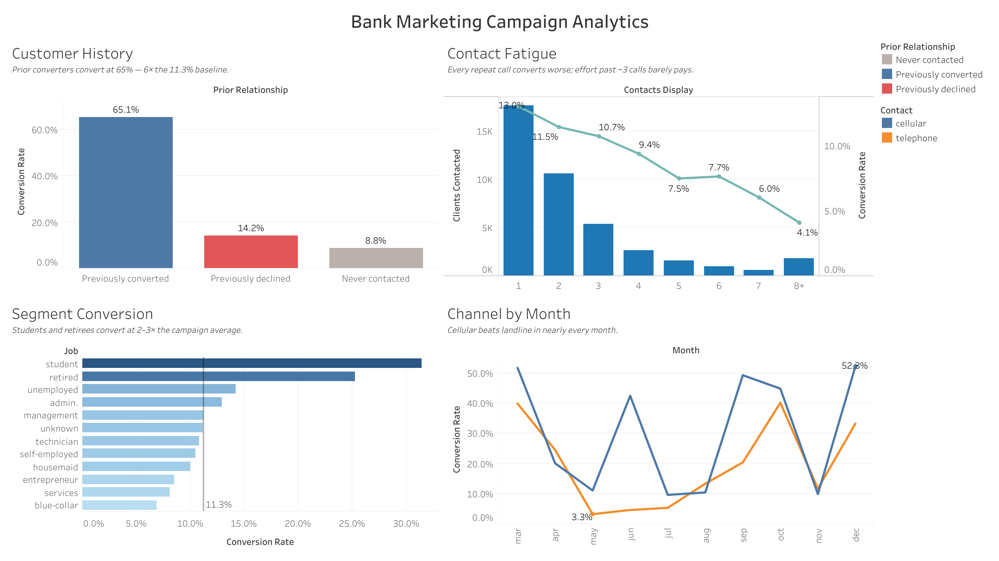

# Bank Marketing Campaign Analytics

Analysis of **41,188 outbound telemarketing contacts** from a Portuguese retail
bank's term-deposit campaign (May 2008 – Nov 2010), quantifying how customer
history, contact frequency and channel engagement drove conversion — and what
the bank should change in its next campaign.

**Stack:** Python (pandas) for ingestion and cleaning · DuckDB as a local
analytical warehouse · SQL for the analysis layer · Tableau for the interactive
dashboard · matplotlib/seaborn for exploratory charts in the notebook.

**🔗 [Live interactive dashboard on Tableau Public](https://public.tableau.com/app/profile/sivansh.satpathy/viz/Book1_17813492980260/Dashboard1)**

## Headline findings

| Finding | Evidence |
|---|---|
| **Customer history is the strongest signal.** Clients who converted in a previous campaign convert again at **65%** — ~6x the 11.3% baseline — yet they were only 3.3% of the call list. | `sql/04_customer_history.sql` |
| **Repeated outreach destroys conversion.** First contacts convert at **13.0%**; by the 7th attempt the rate is **6.0%**, and ~4% beyond that. Clients requiring 4+ contacts absorbed **48% of all dials** but yielded only **12% of conversions**. | `sql/03_contact_frequency.sql` |
| **Students (31%) and retirees (25%)** convert at 2–3x the average; conversion is U-shaped in age while the over-targeted 35–54 core sits *below* average. | `sql/02_conversion_by_segment.sql` |
| **Cellular converts at ~3x landline** (14.7% vs 5.2%), consistently across every month of the campaign. | `sql/05_channel_and_timing.sql` |

## Dashboard

An interactive Tableau dashboard ties the four findings together — customer
history, contact fatigue, segment conversion and channel-by-month — with a
shared age-band filter that re-slices every view at once.

[**▶ Explore the live dashboard**](https://public.tableau.com/app/profile/sivansh.satpathy/viz/Book1_17813492980260/Dashboard1)



Build notes (calculated fields, worksheet layout) are in
[`tableau/DASHBOARD.md`](tableau/DASHBOARD.md).

## Recommendations

1. **Lead with history, not demographics.** Build the next call list starting
   from prior converters and recent prior contacts (50–66% conversion), then
   high-affinity segments (students, retirees), and only then cold names.
2. **Cap contact attempts at ~3 per client.** The fatigue curve is monotonic;
   redirect the ~27% of dials currently spent on 4th-and-later attempts toward
   fresh leads. (Observational data, so the decay isn't strictly causal — but the
   near-zero incremental yield justifies the cap operationally either way.)
3. **Prioritise mobile numbers** in dialler queues and invest in mobile-number
   acquisition for the landline-only book.
4. **Smooth the calendar.** May's volume blast converted worst (3–11%);
   low-volume months converted at 40%+. Spread volume and protect list quality
   over hitting monthly dial quotas.

## Repository structure

```
├── data/
│   ├── raw/bank-additional-full.csv   # source extract (UCI)
│   └── README.md                      # data dictionary + quality notes
├── notebooks/
│   └── 01_exploratory_analysis.ipynb  # executed EDA walkthrough
├── sql/                               # analysis layer, one question per file
├── src/
│   ├── download_data.py               # (re)fetch the raw extract
│   ├── prepare_data.py                # clean + build DuckDB warehouse
│   ├── run_analysis.py                # run sql/ -> outputs/tables/
│   └── export_tableau.py              # dashboard extracts
├── outputs/
│   └── tables/                        # query results (CSV)
└── tableau/
    ├── extracts/                      # Tableau-ready data
    ├── dashboard.png                  # dashboard preview
    └── DASHBOARD.md                   # dashboard design & build notes
```

## Getting started

**Prerequisites:** Python 3.10+ and `pip`. (Tableau Desktop or the free
[Tableau Public](https://public.tableau.com) is only needed if you want to
rebuild the dashboard.)

**1. Clone the repository**

```bash
git clone https://github.com/devpro2410/bank-marketing-campaign-analytics.git
cd bank-marketing-campaign-analytics
```

**2. (Optional) create a virtual environment**

```bash
python -m venv .venv
source .venv/bin/activate        # Windows: .venv\Scripts\activate
```

**3. Install dependencies**

```bash
pip install -r requirements.txt
```

**4. Run the pipeline**

The raw dataset is already included, so you can run the steps in order:

```bash
python src/prepare_data.py     # clean data, build data/bank_marketing.duckdb
python src/run_analysis.py     # run all SQL queries -> outputs/tables/*.csv
python src/export_tableau.py   # regenerate the Tableau extracts
```

That's it — query results land in `outputs/tables/` and dashboard-ready files
in `tableau/extracts/`. To explore the analysis interactively (with charts),
open `notebooks/01_exploratory_analysis.ipynb`.

> The raw CSV ships with the repo. If you ever need to re-fetch it from source,
> run `python src/download_data.py`.

## Methodology notes

- **Duplicates:** 12 exact duplicate rows dropped (41,188 → 41,176 unique
  contacts).
- **Sentinel handling:** `pdays = 999` ("never previously contacted") is
  converted to `NULL` plus an explicit `previously_contacted` flag.
- **Leakage:** `duration` (call length) is only known after a call finishes,
  so it is excluded from all targeting recommendations — using it would
  overstate how well outcomes can be anticipated before dialling.
- **`unknown` categories** are reported as-is rather than imputed.

## Data source

[Bank Marketing dataset](https://archive.ics.uci.edu/dataset/222/bank+marketing),
UCI Machine Learning Repository (CC BY 4.0).

> S. Moro, P. Cortez and P. Rita. *A Data-Driven Approach to Predict the
> Success of Bank Telemarketing.* Decision Support Systems, Elsevier, 62:22-31,
> June 2014.
